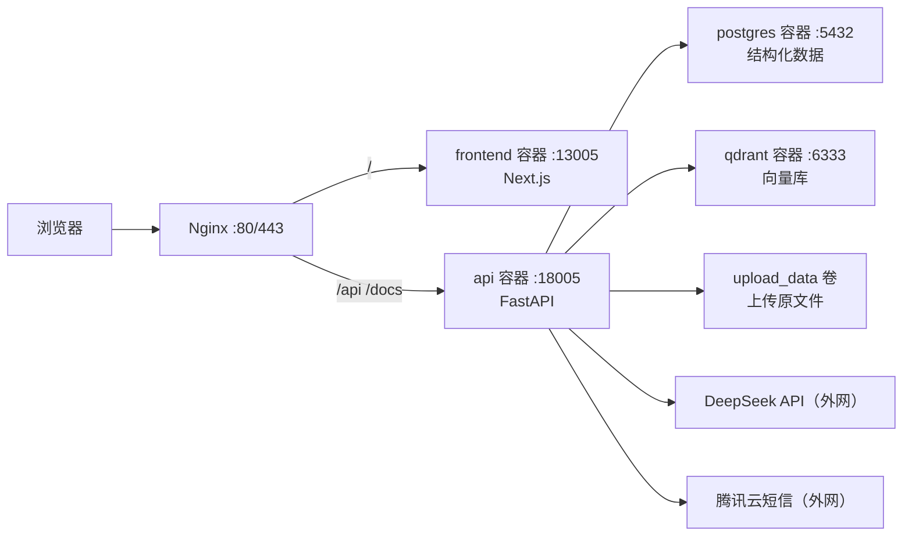

# IMC&IPM 商业决策智能体 · 部署文档（Docker Compose 一键部署）

本文档面向运维工程师，指导将本项目部署到一台 Linux 服务器（如香港云服务器），并保证知识节点、诊断报告、会话记录、向量数据和上传文件在更新代码时不丢失。

整套系统通过根目录 `docker-compose.yml` 一条命令拉起：**PostgreSQL + Qdrant + 后端 API + 前端 + Nginx** 五个容器。运维无需在宿主机单独安装 Python / Node，只需要 Docker。

---

## 0. 30 秒快速部署（已具备 Docker 的服务器）

```bash
# 1. 拉代码
git clone https://github.com/dengyier/IPM-IMC_Agent.git /opt/imc-ipm-agent
cd /opt/imc-ipm-agent

# 2. 配置：复制模板并填写密钥、公网地址
cp .env.example .env
vim .env          # 至少改 POSTGRES_PASSWORD、PUBLIC_BASE_URL，按需填 DEEPSEEK / 腾讯云短信

# 3. 一键构建并启动全部服务
docker compose up -d --build

# 4. 看状态
docker compose ps
```

启动后通过 `http://服务器IP/`（Nginx 默认 80 端口）访问。首次部署若需要导入本地已有知识资产，见 [第 6 节](#6-可选导入本地已有知识资产数据迁移)。

> 如果服务器还没装 Docker，先做 [第 2 节](#2-服务器基础环境docker)。

---

## 1. 架构与端口



| 组件 | 容器名后缀 | 容器内端口 | 是否对公网 | 持久化卷 |
|------|-----------|-----------|-----------|----------|
| Nginx 入口 | `nginx` | 80 (/443) | **是** | — |
| 前端 Next.js | `frontend` | 13005 | 否（经 Nginx） | — |
| 后端 FastAPI | `api` | 18005 | 否（经 Nginx） | — |
| PostgreSQL | `postgres` | 5432 | 否（仅内网） | `postgres_data` |
| Qdrant 向量库 | `qdrant` | 6333 | 否（仅内网） | `qdrant_data` |
| 上传文件目录 | （挂在 api 上） | — | 否 | `upload_data` |

**生产只需对公网开放 `80`（和配置 HTTPS 后的 `443`）**。数据库、向量库、前后端端口默认都不暴露到宿主机，全部走容器内网，安全且省去防火墙配置。需要本机调试时，可在 `docker-compose.yml` 里按注释放开对应 `ports`。

后端所有接口都在 `/api/...` 前缀下；`/docs` 为 Swagger 文档。

---

## 2. 服务器基础环境（Docker）

推荐 Ubuntu 22.04/24.04 LTS，2C4G 起步，建议 4C8G，磁盘 ≥ 80GB。

安装 Docker 与 Compose 插件：

```bash
sudo apt update
sudo apt install -y git curl
curl -fsSL https://get.docker.com | sudo sh
sudo systemctl enable --now docker

# 让当前用户免 sudo 使用 docker（重新登录后生效）
sudo usermod -aG docker $USER
```

确认：

```bash
docker version
docker compose version
```

> 如服务器在受限网络/需走代理才能访问外网（拉镜像、调用 DeepSeek），请给 Docker daemon 配置代理，并在 `.env` 里追加 `NO_PROXY=localhost,127.0.0.1,postgres,qdrant`，避免容器间互访也被代理拦截（详见 [第 9 节常见问题](#9-常见问题)）。

---

## 3. 获取代码与配置

```bash
sudo mkdir -p /opt/imc-ipm-agent && sudo chown -R $USER:$USER /opt/imc-ipm-agent
git clone https://github.com/dengyier/IPM-IMC_Agent.git /opt/imc-ipm-agent
cd /opt/imc-ipm-agent
cp .env.example .env
vim .env
```

`.env` 关键项说明：

| 变量 | 必填 | 说明 |
|------|------|------|
| `PUBLIC_BASE_URL` | **是** | 浏览器访问的**根地址，不要带 `/api`**。走 Nginx 填 `http://服务器IP` 或 `https://域名`；直连后端调试填 `http://服务器IP:18005`。**构建期注入，改了要重新 build 前端**。 |
| `POSTGRES_PASSWORD` | **是** | 生产务必改强密码。 |
| `DEEPSEEK_API_KEY` | 建议 | 留空则后端用本地确定性回退，能跑通流程但无真实大模型生成。 |
| `EMBEDDING_DIM` | 否 | 默认 256，**迁移老数据时不要改**，需与已建向量维度一致。 |
| 腾讯云短信 `TENCENT*` | 视需求 | 不填则无法发送登录验证码。 |

> ⚠️ `PUBLIC_BASE_URL` 不能写成 `.../api`。前端代码里的请求路径已经带 `/api`（如 `/api/assistant/ask`），若 base 再带 `/api` 会变成 `/api/api/...` 导致 404。

安全要求：`.env` 已被 `.gitignore` 忽略，**不要提交**；密钥只放服务器。若密钥曾出现在聊天/截图/日志中，上线前请轮换。

---

## 4. 一键启动

```bash
cd /opt/imc-ipm-agent
docker compose up -d --build
docker compose ps          # 所有服务应为 running / healthy
docker compose logs -f api # 看后端启动日志，出现 "Application startup complete" 即就绪
```

后端首次启动会自动建表（`init_db()`），无需手动建数据库结构。

镜像/卷说明（更新代码不丢数据的关键）：

- `postgres_data`：PostgreSQL 数据卷。
- `qdrant_data`：Qdrant 向量数据卷。
- `upload_data`：上传的课件/资料原文件。

这三个卷在 `docker compose up/down`、重新 build、`git pull` 时都**不会**被删除。

> 🚫 **严禁**在有生产数据的服务器执行 `docker compose down -v` 或 `docker volume rm` —— 这会删除上述卷，知识资产不可恢复。

---

## 5. 验收

```bash
# 后端（在服务器本机，经 Nginx）
curl http://localhost/api/system/health   # 或任一公开接口
curl http://localhost/docs                 # Swagger 文档
```

浏览器访问 `http://服务器IP/`（或 `https://域名/`）：

1. 打开登录页，用手机号获取验证码登录（需已配置腾讯云短信）。
2. 工作台左侧「知识资产沉淀中」显示资料数、节点数、关系边、报告数。
3. 知识节点库 / 知识网络图谱能展示真实节点与关系。
4. 向 IMC&IPM 智能助手提问，回答能引用知识节点。
5. 商业画布诊断可生成报告，刷新后报告仍在（已持久化）。

---

## 6. （可选）导入本地已有知识资产（数据迁移）

仅当需要把**本地已调教好的**知识节点、诊断报告、会话、上传文件和向量同步到这台服务器时才做。全新空库部署可跳过本节。

要迁移三类数据：① 结构化数据（本地 SQLite `backend/data/imc_ipm.db` → 生产 PostgreSQL）；② 上传文件（`backend/data/uploads`）；③ Qdrant 向量（用结构化数据在生产侧重建）。

### 6.1 本地打包

在本地电脑执行：

```bash
cd "你的本地项目目录"
mkdir -p /tmp/imc-migration
cp backend/data/imc_ipm.db /tmp/imc-migration/imc_ipm.db
tar czf /tmp/imc-migration/uploads.tar.gz -C backend/data uploads
```

### 6.2 上传到服务器

```bash
scp -r /tmp/imc-migration root@服务器IP:/opt/imc-migration
```

### 6.3 导入结构化数据到 PostgreSQL

迁移脚本已打包进 `api` 镜像，直接在容器内运行。先把本地库拷进容器：

```bash
cd /opt/imc-ipm-agent
docker compose cp /opt/imc-migration/imc_ipm.db api:/tmp/imc_ipm.db

# 先 dry-run 确认能读取（dry-run 不写目标库，可不传 --target）
docker compose exec api python scripts/migrate_sqlite_to_postgres.py \
  --source sqlite:////tmp/imc_ipm.db --dry-run

# 正式导入：用容器内的 $DATABASE_URL 作为目标库（已指向 postgres 容器）。
# 首次迁入空库用 --replace（清空目标库本系统表后重灌）；目标库已有数据则去掉 --replace
docker compose exec api sh -c \
  'python scripts/migrate_sqlite_to_postgres.py --source sqlite:////tmp/imc_ipm.db --target "$DATABASE_URL" --replace'
```

> 脚本的 `--target` 默认读环境变量 `TARGET_DATABASE_URL`，而容器里设置的是 `DATABASE_URL`，因此正式导入必须显式传 `--target "$DATABASE_URL"`（上面用 `sh -c` 让变量在容器内展开）。

### 6.4 恢复上传文件到卷

```bash
# 解压到本机临时目录，再拷进 api 容器的 /data/uploads（即 upload_data 卷）
mkdir -p /tmp/uploads-restore
tar xzf /opt/imc-migration/uploads.tar.gz -C /tmp/uploads-restore
docker compose cp /tmp/uploads-restore/uploads/. api:/data/uploads/
docker compose exec api sh -c "ls -lah /data/uploads | head"
```

### 6.5 在生产重建 Qdrant 向量

结构化数据导入后，用 PostgreSQL 里的切块重建向量集合：

```bash
docker compose exec api python scripts/rebuild_vector_collections.py --recreate
```

- `--recreate` 会重建 `methodology_core_chunks` 与 `expansion_chunks` 两个集合，首次迁移推荐。
- 生产已有向量且不能删时去掉 `--recreate`，脚本按相同 point id upsert。

完成后核对：

```bash
docker compose exec api python -c "import urllib.request,json; \
print(json.load(urllib.request.urlopen('http://qdrant:6333/collections/methodology_core_chunks'))['result']['points_count'])"
```

### 6.6 后续知识更新方式

不要手改数据库。推荐：超管在资料中心上传新课件/笔记 → 系统解析抽取节点与关系 → 需审核的扩展进人工审核台 → 通过后进入图谱与诊断上下文。向量随处理流程自动写入；如发现不一致，重跑 `rebuild_vector_collections.py`。临时目录批量增量导入可用 `scripts/kg_incremental.py`（按文件去重、合并同名节点、不清空旧图谱）。

---

## 7. 配置 HTTPS / 域名

1. 域名 A 记录解析到服务器公网 IP。
2. 推荐用宿主机的 certbot 申请证书，或在 `deploy/certs/` 放置证书后，在 [`deploy/nginx.conf`](../deploy/nginx.conf) 增加 `listen 443 ssl` 的 server 块，并在 `docker-compose.yml` 放开 nginx 的 `443:443` 与 `./deploy/certs` 挂载。
3. 将 `.env` 的 `PUBLIC_BASE_URL` 改为 `https://域名`（不带 `/api`），然后**重新构建前端**：

```bash
docker compose up -d --build frontend
```

---

## 8. 更新发布流程

更新前**先备份**（见 [第 10 节](#10-备份与恢复)），尤其是已有生产数据后。常规更新只改代码、不动数据卷：

```bash
cd /opt/imc-ipm-agent
git pull origin main
docker compose up -d --build      # 自动重建变更的镜像并平滑替换容器
docker compose ps
docker compose logs -f api
```

- 后端表结构变化由 `init_db()` 在启动时处理。
- 仅前端公网地址变化（改 `PUBLIC_BASE_URL`）时记得 `--build frontend`。

---

## 9. 常见问题

**1. 前端能打开但所有接口报错 / CORS / 打到错端口**
多半是 `PUBLIC_BASE_URL` 配错。它必须是根地址、**不带 `/api`**，且改后要 `docker compose up -d --build frontend`（构建期注入）。确认浏览器请求地址是 `公网地址/api/...` 而不是 `.../api/api/...`。

**2. 容器间访问被代理拦截 / 连不上 postgres、qdrant、503**
服务器配了 `HTTP_PROXY` 时，Python 的 httpx 会把容器内地址也走代理导致失败。在 `.env` 增加：
```
NO_PROXY=localhost,127.0.0.1,postgres,qdrant
no_proxy=localhost,127.0.0.1,postgres,qdrant
```
然后 `docker compose up -d`。

**3. 短信验证码发不出**
`docker compose logs -f api` 看错误，核对 `TENCENT*` 五项及腾讯云签名/模板是否审核通过；手机号会自动规范为 `+86...`。

**4. DeepSeek 不生效**
确认 `.env` 的 `DEEPSEEK_API_KEY`、`DEEPSEEK_MODEL=deepseek-v4-pro`，改后 `docker compose up -d api`。留空则走本地回退（非真实大模型）。

**5. 上传大文件失败**
Nginx 已设 `client_max_body_size 200m`（见 `deploy/nginx.conf`），如需更大自行调整并 `docker compose restart nginx`。

**6. 报告/数据刷新后消失**
检查是否误删数据卷。生产数据全在 `postgres_data`/`qdrant_data`/`upload_data`，不要用 `down -v`。

**7. Qdrant 版本**
编排默认 `qdrant/qdrant:latest`（当前为 1.18.x，代码已适配其 `query_points` 接口）。追求可复现可在 `docker-compose.yml` 固定为 `qdrant/qdrant:v1.18.2`。

---

## 10. 备份与恢复

**每日备份建议**（保留至少 7 天）。知识资产、诊断报告、向量是核心资产，不能只备份代码。

备份：

```bash
cd /opt/imc-ipm-agent
TS=$(date +%F_%H%M%S)
mkdir -p /opt/imc-backups

# PostgreSQL 逻辑备份
docker compose exec -T postgres pg_dump -U "${POSTGRES_USER:-imc}" "${POSTGRES_DB:-imc_ipm}" > /opt/imc-backups/pg_$TS.sql

# Qdrant 卷打包
docker run --rm -v imc-ipm-agent_qdrant_data:/data -v /opt/imc-backups:/backup alpine \
  tar czf /backup/qdrant_$TS.tar.gz -C /data .

# 上传文件卷打包
docker run --rm -v imc-ipm-agent_upload_data:/data -v /opt/imc-backups:/backup alpine \
  tar czf /backup/uploads_$TS.tar.gz -C /data .
```

> 卷名 = `<项目目录名>_<卷key>`。本文档项目目录为 `imc-ipm-agent`，故卷名形如 `imc-ipm-agent_qdrant_data`。用 `docker volume ls | grep imc` 确认实际名称。

恢复（PostgreSQL）：

```bash
cat /opt/imc-backups/pg_2026-06-06.sql | docker compose exec -T postgres psql -U imc imc_ipm
```

恢复（Qdrant 卷，需先停容器）：

```bash
docker compose stop qdrant
docker run --rm -v imc-ipm-agent_qdrant_data:/data -v /opt/imc-backups:/backup alpine \
  sh -c "rm -rf /data/* && tar xzf /backup/qdrant_2026-06-06.tar.gz -C /data"
docker compose start qdrant
```

---

## 11. 命令速查

| 操作 | 命令 |
|------|------|
| 启动全部 | `docker compose up -d --build` |
| 查看状态 | `docker compose ps` |
| 看某服务日志 | `docker compose logs -f api` |
| 重启某服务 | `docker compose restart api` |
| 只重建前端 | `docker compose up -d --build frontend` |
| 进后端容器 | `docker compose exec api sh` |
| 重建向量 | `docker compose exec api python scripts/rebuild_vector_collections.py --recreate` |
| 停止（**保留数据**） | `docker compose down` |
| ⚠️ 停止并删数据卷 | `docker compose down -v`（**禁止用于生产**） |
